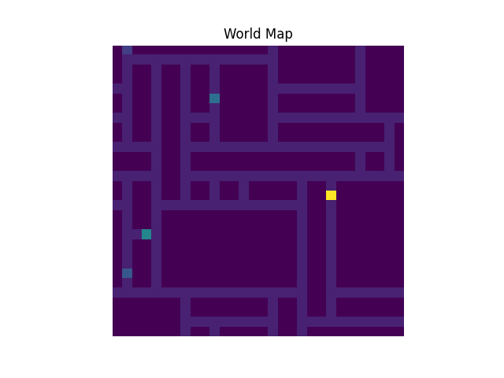

# Introduction: ToMnet-N

ToMnet-N (Theory of Mind network by Nikita) is a Deep Learning model of ToMnet family (ToMnet, ToM2C, Trait-ToM, ToMnet+). It is a Transformers version of ToMnet that is supposed to perform Theory of Mind tasks in a Grid World game. It observes bechaviour of the bot-player and performs predictions of trajectory, which type of agent it is and which goal a player is going to consume by the end of the game. 

# Methodology

- About the game
- About the AI player
- About ToMnet-N



# Project Structure

Project structure is based on Cookiecutter 
Please read here for description and specification on each folder: http://drivendata.github.io/cookiecutter-data-science/ 

```bash
├── LICENSE
├── Makefile           <- Makefile with commands like `make data` or `make train`
├── README.md          <- The top-level README for developers using this project.
├── data               <- Generated datasets
│
├── docs               <- A default Sphinx project; see sphinx-doc.org for details
│
├── models             <- Trained and serialized models, model predictions, or model summaries
│
├── notebooks          <- Jupyter notebooks for model / data exploration. Naming convention is a number (for ordering),
│                         the creator's initials, and a short `-` delimited description, e.g.
│                         `1.0-jqp-initial-data-exploration`.
│
├── references         <- Data dictionaries, manuals, and all other explanatory materials.
│
├── reports            <- Generated analysis as HTML, PDF, LaTeX, etc.
│   └── figures        <- Generated graphics and figures to be used in reporting
│
├── requirements.txt   <- The requirements file for reproducing the analysis environment
│
├── environment.yml    <- Environmental dependencies for reproducing the analysis environment
│
├── src                <- Source code for use in this project.
│   ├── __init__.py    <- Makes src a Python module
│   │
│   ├── data           <- Scripts to download or generate data
│   │   └── make_dataset.py
│   │
│   ├── features       <- Scripts to turn raw data into features for modeling
│   │   └── build_features.py
│   │
│   ├── model         <- Scripts to train models and then use trained models to make
│   │   │                 predictions
│   │   ├── predict_model.py
│   │   └── train_model.py
│   │
│   └── visualization  <- Scripts to create exploratory and results oriented visualizations
│       └── visualize.py
│
├── tests                <- Unit tests for each module
│   ├── test_bot_ai.py   <- Set of tests for player in the Grid World
│   ├── test_map_gen.py  <- Set of tests for generating Grid World games or maps
│   └── tets_tomnet_n.py <- Set of tests for verifying ToMnet-N model
│
└── tox.ini            <- tox file with settings for running tox; see tox.readthedocs.io
```

Documentation is generated with Sphinx and hosted on Read The Docs - *URL*

> `sphinx-build -b html docs/source/ docs/build/html` to generate web page